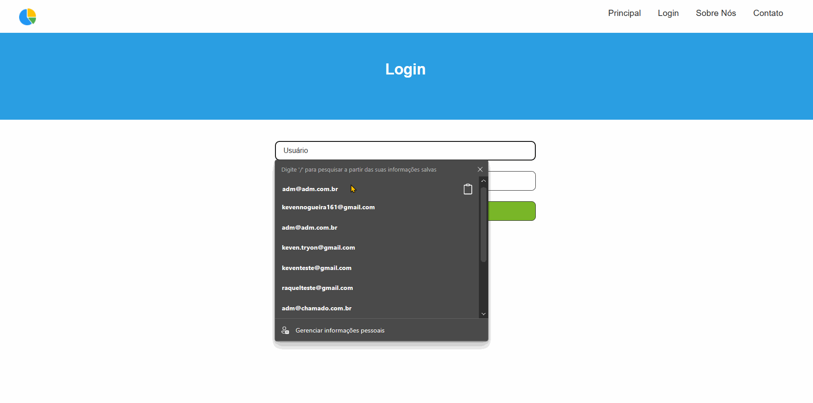

<h1 align="center">
    Super Gestão  <br>
    <!-- <p>   </p> -->
</h1>

## 📃 Projeto

O **Super Gestão** é o sistema online de controle administrativo que pode transformar e potencializar os negócios da sua empresa.

Desenvolvido com a mais alta tecnologia para você cuidar do mais importa em seus negócios!

Com o sistema do Super Gestão e possivel centralizar em apenas um lugar, as partes mais importantes de seu negocio como:

-   Cadastro de Produtos e Fornecedores
-   Visualização de Estoque e Cadastro de Clientes
-   Construção de pedidos

O Super Gestão tem como foco agilizar o seu tempo!

#### “Com organização e tempo, acha-se o segredo de fazer tudo e bem feito.” – Pitágoras

## ⚒️ Ferramentas

-   [PHP 8.2 / Laravel 10x](https://laravel.com/docs/10.x)
-   [MySQL 8.0](https://www.mysql.com/)
-   [HTML - CSS - JS](https://www.w3schools.com/html/)

## 💻 Contribuir para o Projeto

### Clonar o projeto

```
git clone https://github.com/KevenNogueira/app-super-gestao.git
```

### Gerando o arquivo .env

```
cp.env.example .env
```

### Variaveis do Banco de Dados

```
DB_CONNECTION=mysql
DB_HOST=db
DB_PORT=3306
DB_DATABASE=super_gestao
DB_USERNAME=root
DB_PASSWORD=
```

### Execução das migrates

```
php artisan migrate
```

### Execução das seeders

```
php artisan db:seed
```

### Execução do Projeto

```
php artisan serve
```

## ✨ Entrando no Projeto

Após a execução dos passos acima, o comando `php artisan serve` irá disponibilizar o link para acesso ao projeto, com das as seeders iniciadas basta ir a tela de **login** e entrar com os dados

-   Usuario: adm@adm.com.br
-   Senha: 1adm@adm


